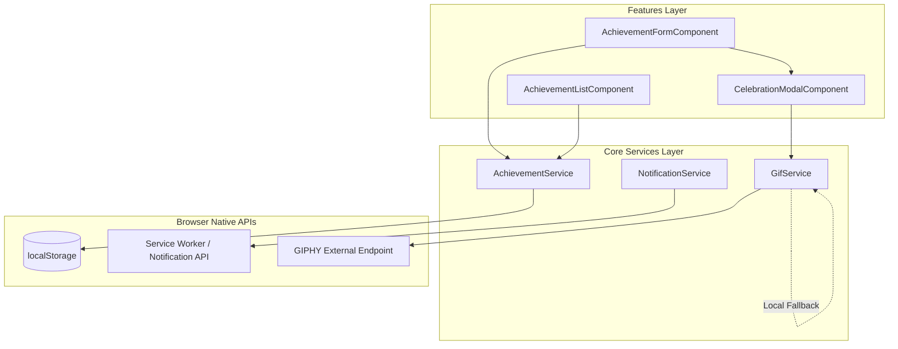

# Architecture Spine — Yay-me

## 1. Design Paradigm

Yay-me follows a **Layered Client-Only Feature-Driven SPA Architecture** powered by Angular standalone components and RxJS singleton services. 

- **Core Layer (`src/app/core/services/`)**: Owns state storage, external GIPHY API calls, and browser Service Worker / Notification abstractions.
- **Feature Layer (`src/app/features/achievements/`)**: Isolated UI presentation components (`AchievementListComponent`, `AchievementFormComponent`, `CelebrationModalComponent`).
- **Shared Domain (`src/app/shared/models/`)**: Pure TypeScript interfaces and data models (`Achievement`).



---

## 2. Invariants & Rules

### AD-1 — Feature-Driven Directory Isolation
- **Binds:** `all` (`src/app/`)
- **Prevents:** Circular component dependencies, spaghetti imports, and leaking UI logic into singleton core services.
- **Rule:** Component modules under `features/` MUST NOT import sibling feature components. Cross-component communication MUST occur via singleton services under `core/services/` or shared models in `shared/models/`.

### AD-2 — Single Source of Truth for Achievement State
- **Binds:** `FR-1.1`, `FR-1.2`, `FR-1.3`, `FR-1.4`
- **Prevents:** Desynchronization between `localStorage` data and reactive UI views.
- **Rule:** All reads and writes to `localStorage['yay-me:achievements']` MUST be encapsulated within `AchievementService`. UI components MUST subscribe to an RxJS `Observable<Achievement[]>` exposed by `AchievementService` (`BehaviorSubject`).

### AD-3 — Resilient GIPHY API Fallback Strategy
- **Binds:** `FR-2.2`, `FR-2.3`, `NFR-2`
- **Prevents:** Blank or broken celebration modals when offline, rate-limited, or facing network failure.
- **Rule:** `GifService` MUST wrap GIPHY API HTTP requests with a fallback operator (`catchError`). If the HTTP request fails or times out (2000ms), it MUST return a random GIF URL from a local static fallback array (`src/app/core/services/gifs.ts`).

### AD-4 — Idempotent Daily Notification Reminder Pattern
- **Binds:** `FR-3.2`, `FR-3.3`, `FR-3.4`
- **Prevents:** Multiple notification popups during the same day or spamming users on app reload.
- **Rule:** `NotificationService` MUST compare the current ISO date (`YYYY-MM-DD`) against `localStorage['yay-me:last-notification']` before triggering a notification. A notification MAY ONLY be dispatched if the saved date is older than today, and the timestamp MUST be updated immediately after dispatch.

### AD-5 — Secret Injection at Build Time
- **Binds:** `NFR-5`
- **Prevents:** Committing API keys to git repositories or exposing secrets in client source control.
- **Rule:** GIPHY API keys MUST be loaded via environment configuration (`environment.ts`) injected during the build step (GitHub Actions / Netlify). No plain-text API key string MAY exist in committed `.ts` source files.

---

## 3. Consistency Conventions

| Concern | Convention | Example |
| --- | --- | --- |
| **Naming** | Kebab-case files, PascalCase classes, camelCase methods/variables | `achievement.service.ts` -> `AchievementService` |
| **Data Formats** | UUID v4 string for IDs, ISO 8601 UTC strings for dates | `createdAt: "2026-08-08T15:40:00.000Z"` |
| **Storage Keys** | Prefix all `localStorage` keys with `yay-me:` | `yay-me:achievements`, `yay-me:last-notification` |
| **RxJS Naming** | Dollar sign suffix for Observable streams | `achievements$: Observable<Achievement[]>` |

---

## 4. Stack

| Name | Version / Specification |
| --- | --- |
| **Angular** | v17+ (Standalone Components enabled) |
| **PrimeNG** | v17+ (PrimeIcons + PrimeFlex) |
| **RxJS** | v7.8+ |
| **Jest** | v29+ (Unit testing) |
| **Playwright** | v1.40+ (E2E testing) |
| **Node.js** | v20 LTS |

---

## 5. Structural Seed

```text
src/app/
  core/
    services/
      achievement.service.ts     # Handles CRUD & localStorage sync
      notification.service.ts    # Manages PWA notification triggers
      gif.service.ts             # GIPHY API integration & fallback logic
      motivational-phrases.ts    # Static list of celebration quotes
      gifs.ts                    # Fallback static array of GIF URLs
  features/
    achievements/
      achievement-list/          # Displays timeline / p-card list
      achievement-form/          # Input form for new wins
      celebration-modal/         # p-dialog popup with GIF & phrase
  shared/
    models/
      achievement.model.ts       # Achievement interface definition
  app.config.ts                  # Angular application configuration
  app.routes.ts                  # Route definitions
```

---

## 6. Capability → Architecture Map

| Capability / Requirement | Lives in | Governed by |
| --- | --- | --- |
| Achievement CRUD & Storage | `AchievementService` | `AD-1`, `AD-2` |
| Timeline & Cards View | `AchievementListComponent` | `AD-1` |
| Celebration Modal & GIF | `CelebrationModalComponent` / `GifService` | `AD-3`, `AD-5` |
| Daily Reminders & PWA | `NotificationService` | `AD-4` |

---

## 7. Deferred

- **Backend Database & Authentication:** Deferred until v2 (Client-only v1 meets current scope).
- **Data Export/Import (JSON Backup):** Deferred until v2 (Low complexity addition when requested).
- **Analytics & Error Tracking:** Deferred until public launch (Not required for solo/hobby scope).
