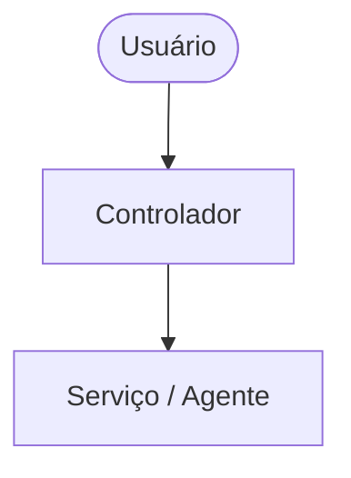

# SDD-000X: [Título do Documento]

* **Autor:** [Nome do Autor]
* **Data:** AAAA-MM-DD
* **Status:** [Rascunho | Em Revisão | Aprovado | Implementado]
* **Tags:** [#tag1 #tag2]

---

## 1. Visão Geral e Contexto
Descreva sucintamente o problema que está sendo resolvido e o objetivo geral da solução.

## 2. Objetivos e Não-Objetivos (Goals & Non-Goals)
- **Objetivos (Goals):**
  - Requisito 1
  - Requisito 2
- **Não-Objetivos (Non-Goals):**
  - O que não faz parte do escopo desta entrega.

## 3. Arquitetura Proposta
Visão geral do design e fluxo da aplicação.

## 4. Especificação Técnica
- **Componentes e Arquivos:** Lista dos arquivos que serão criados ou alterados.
- **Interfaces e Contratos:** Formatos de dados (JSON, interfaces TypeScript, schemas Pydantic).

## 5. Alternativas Consideradas
Outras soluções analisadas e motivos da escolha do formato atual.

## 6. Plano de Validação e Testes
Como testar e validar se a funcionalidade foi implementada corretamente.

## 7. Riscos e Questões Abertas
- [ ] Dúvida A
- [ ] Risco de desempenho no cenário B
