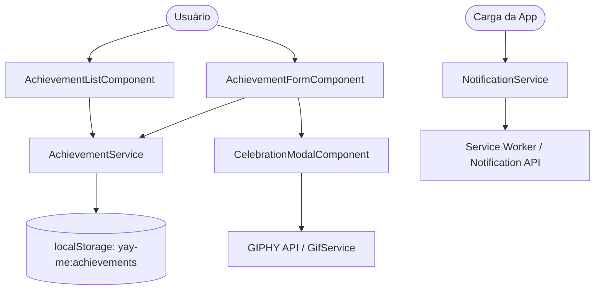

# SDD-0001: Arquitetura Inicial Yay-me

* **Autor:** Diego
* **Data:** 2026-08-08
* **Status:** Aprovado
* **Tags:** #angular #primeng #netlify #pwa #giphy #jest #playwright #architecture

---

## 1. Visão Geral e Contexto
O **Yay-me** é uma SPA (Single Page Application) client-only desenvolvida com Angular e PrimeNG para registro e celebração de conquistas diárias, contando com notificações locais via Service Worker e gifs comemorativos via GIPHY API. O deploy é automatizado na plataforma Netlify via integração com o GitHub.

## 2. Objetivos e Não-Objetivos (Goals & Non-Goals)
- **Objetivos (Goals):**
  - CRUD local de conquistas (`Achievement`) armazenado via `localStorage`.
  - Exibição de conquistas com linha do tempo ou cards PrimeNG (`p-timeline` / `p-card`).
  - Modal de celebração (`CelebrationModalComponent`) consumindo gifs aleatórios da GIPHY API com frases motivacionais.
  - Lembrete/notificação diária via Service Worker (`@angular/pwa`) + Notification API.
  - Esteira CI/CD automatizada com GitHub Actions (Lint, Jest, Playwright, Build) e deploy no Netlify.
- **Não-Objetivos (Non-Goals):**
  - Backend ou banco de dados externo nesta v1 (arquitetura 100% client-only).
  - Gerenciamento de estado complexo como NgRx (gerenciado via Services + RxJS).
  - Garantia de disparo de notificações com app 100% fechado em iOS (limitação de SO documentada).

## 3. Arquitetura Proposta

### 3.1 Tabela de Tecnologias

| Camada | Tecnologia |
|---|---|
| Framework | Angular (standalone components, última versão estável) |
| Design System | PrimeNG + PrimeIcons + PrimeFlex |
| Estado | Services + RxJS (sem NgRx — complexidade não justifica em v1) |
| Persistência | `localStorage` via serviço dedicado |
| PWA / Notificações | Angular Service Worker (`@angular/pwa`) + Notification API |
| Testes unitários | Jest (substituindo Karma/Jasmine padrão) |
| Testes E2E | Playwright |
| CI | GitHub Actions |
| CD / Hosting | Netlify (build automático conectado ao GitHub) |

### 3.2 Estrutura de Arquivos (`src/app/`)

```text
src/app/
  core/
    services/
      achievement.service.ts     # CRUD no localStorage
      notification.service.ts    # permissão + agendamento diário
      motivational-phrases.ts    # lista estática de frases
      gifs.ts                    # lista curada de gifs (URLs) e integração GIPHY
  features/
    achievements/
      achievement-list/
      achievement-form/
      celebration-modal/
  shared/
    models/
      achievement.model.ts
  app.config.ts
  app.routes.ts
```

### 3.3 Fluxo da Aplicação



## 4. Especificação Técnica

### 4.1 Modelo de Dados (`achievement.model.ts`)
```ts
export interface Achievement {
  id: string;        // uuid
  text: string;
  createdAt: string; // ISO 8601
}
```
Armazenado em `localStorage` sob a chave `yay-me:achievements`, como array JSON.

### 4.2 Componentes Principais
- **AchievementListComponent:** Lista as conquistas (`p-timeline` ou `p-card` agrupado por data).
- **AchievementFormComponent:** Input e botão de salvar (`p-inputTextarea` + `p-button`).
- **CelebrationModalComponent:** Dialog PrimeNG (`p-dialog`), exibe gif aleatório vindo da GIPHY API (endpoint `/random` ou `/search` com tag `celebration`/`yay`) + frase motivacional aleatória.
- **NotificationService:** Registra o Service Worker, solicita permissão e verifica `localStorage['yay-me:last-notification']`. Se a data for anterior a hoje, dispara a `Notification` API e atualiza a data.

### 4.3 Integração GIPHY API & Segredos
- A chave da API GIPHY (`GIPHY_API_KEY`) **não é commitada**.
- **Desenvolvimento Local:** Arquivo `.env` (listado no `.gitignore`), injetado em build time.
- **CI (GitHub Actions):** Cadastrada em *Repository Secrets* (`GIPHY_API_KEY`) e injetada no `.github/workflows/ci.yml`.
- **Produção (Netlify):** Configurada em *Site Settings > Environment Variables*.
- **Plano de Fallback:** Se a chamada à GIPHY API falhar (rate limit ou offline), o `GifService` utiliza uma lista estática local de gifs como plano B.

### 4.4 Notificação Diária (Local Reminder Pattern)
1. Ao carregar o app, o `NotificationService` checa a última data notificada em `localStorage`.
2. Se diferente de hoje, sorteia frase motivacional e exibe `new Notification(...)` (se permissão concedida).
3. Atualiza `localStorage['yay-me:last-notification']` com a data atual.

## 5. Alternativas Consideradas
- **Karma/Jasmine vs. Jest:** Escolhido Jest por ser mais rápido e possuir melhor DX para testes unitários.
- **NgRx vs. RxJS Services:** NgRx foi descartado nesta v1 por adicionar complexidade desnecessária para a gestão do estado simples em `localStorage`.
- **Backend Node/Firebase vs. Client-Only:** Client-only escolhido para maximizar simplicidade, privacidade e zerar custo de hospedagem.

## 6. Plano de Validação e Testes (CI/CD)

### 6.1 Esteira de CI (GitHub Actions - `.github/workflows/ci.yml`)
Disparada em `push` e `pull_request`:
1. Checkout do código
2. Setup Node + cache de dependências
3. `npm ci`
4. Lint (`eslint`)
5. Testes unitários (`jest`)
6. Build de produção (`ng build`)
7. Testes E2E (`playwright test`) contra o build local

### 6.2 Fluxo de Deploy (Netlify + GitHub)
- **Produção:** Todo push na branch `main` dispara deploy automático para produção.
- **Deploy Previews:** Todo Pull Request para `main` gera um Deploy Preview automático no Netlify.
- **Branches:** Toda nova funcionalidade deve usar o prefixo `feature/` (ex: `feature/celebration-modal`).

## 7. Riscos e Questões Abertas
- [ ] **Visibilidade do Repositório GitHub:** A definir (Público ou Privado).
- [ ] **Domínio Netlify:** Sugestão inicial `yay-me.netlify.app`.
- [ ] **Limitação iOS Notification API:** Notificações locais não são garantidas se o navegador no iOS estiver completamente fechado.
