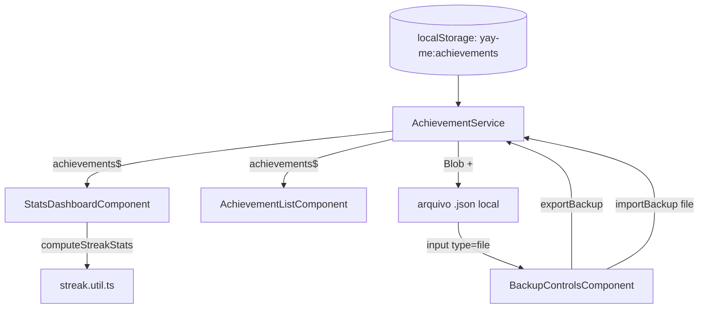

# SDD-0003: Streak/Estatísticas e Backup Local

* **Autor:** Claude (agente de IA)
* **Data:** 2026-08-09
* **Status:** Implementado
* **Tags:** #streak #estatisticas #backup #localstorage #ui

---

## 1. Visão Geral e Contexto
Duas lacunas identificadas numa revisão de "próximos passos" do projeto:

1. O PRD cita "número de dias consecutivos com pelo menos uma conquista"
   como métrica de sucesso (`prd.md`, seção 6.1), mas isso nunca aparece
   na UI — o usuário não tem nenhum retorno visual do próprio progresso
   ao longo do tempo.
2. O app é **100% `localStorage`** por design (NFR-4 do PRD, privacidade)
   — mas isso significa que limpar o cache do navegador, trocar de
   dispositivo ou reinstalar o PWA apaga o histórico inteiro, sem
   qualquer possibilidade de recuperação. É o maior risco de perda de
   dado do produto hoje.

## 2. Objetivos e Não-Objetivos (Goals & Non-Goals)
- **Objetivos (Goals):**
  - Mostrar a sequência atual de dias consecutivos, o recorde e o total
    de conquistas, com um visual inspirado em "complicações" de relógio
    de saúde (pedido explícito do usuário), mantendo a paleta de cores
    leves já estabelecida no resto do app.
  - Permitir exportar todas as conquistas pra um arquivo `.json` local, e
    reimportar esse arquivo depois (mesmo dispositivo ou outro),
    recuperando o histórico sem depender de nenhum servidor.
- **Não-Objetivos (Non-Goals):**
  - Não é sincronização em nuvem/entre dispositivos — é backup manual,
    sob controle do usuário, consistente com o posicionamento
    "zero coleta de dados" do app.
  - Não inclui edição de conquistas nem metas configuráveis de streak
    (ex.: "minha meta é 5 dias/semana") — o anel usa uma meta implícita
    fixa de 7 dias só como referência visual de progresso.

## 3. Arquitetura Proposta



## 4. Especificação Técnica

### Componentes e Arquivos
- `src/app/core/services/streak.util.ts` (novo): função pura
  `computeStreakStats(achievements, referenceDate = new Date())`.
  Agrupa os `createdAt` por dia no fuso local (`getFullYear/Month/Date`,
  não UTC, pra bater com como a lista já agrupa por dia). Sequência
  atual conta pra trás a partir de hoje; se hoje ainda não tem
  conquista, começa a contar a partir de ontem (sequência "viva" até o
  dia acabar sem registro). Sequência recorde percorre todos os dias
  únicos ordenados e mede a maior sequência de dias consecutivos já
  vista, independente da atual.
- `src/app/features/achievements/stats-dashboard/stats-dashboard.component.ts`
  (novo): três "dials" — dois círculos sólidos simples (recorde 🏆,
  total ✅) e um anel central (SVG `<circle>` com `stroke-dasharray`/
  `stroke-dashoffset`) mostrando a sequência atual 🔥, com o progresso do
  anel calculado como `min(currentStreak, 7) / 7`. Escondido via
  `*ngIf`/classe quando `total === 0` (evita mostrar zeros pra quem
  ainda não usou o app).
- `src/app/features/achievements/backup-controls/backup-controls.component.ts`
  (novo): dois botões (`pButton` estilo texto) — exportar dispara
  `AchievementService.exportBackup()` direto; importar aciona um
  `<input type="file">` escondido, lê o arquivo e chama
  `importBackup(file)`. Mensagem de status inline (sucesso em verde,
  erro em vermelho) some sozinha depois de 4s — mesmo padrão de
  temporizador já usado na confirmação de exclusão da lista.
- `src/app/core/services/achievement.service.ts`: dois métodos novos.
  - `exportBackup()`: serializa o estado atual (`JSON.stringify`,
    indentado) num `Blob`, cria um `<a download>` temporário e dispara o
    clique — sem chamada de rede, tudo local.
  - `importBackup(file)`: lê o arquivo (`file.text()`), valida que é um
    array e que cada item tem `id`/`text`/`createdAt` como string
    (`isValidAchievement`) — se qualquer item for inválido, rejeita o
    arquivo inteiro **antes** de gravar qualquer coisa (import é
    tudo-ou-nada). Itens com `id` que já existe são pulados (nunca
    duplica, nunca sobrescreve); os novos entram e a lista é reordenada
    por `createdAt`. Retorna `{ imported, skipped }` pro componente
    mostrar um resumo.
- `src/app/app.component.ts`: adiciona `<app-stats-dashboard>` no topo
  do `app-shell` (acima do formulário) e `<app-backup-controls>` no
  rodapé (abaixo da lista).

### Interfaces e Contratos
```ts
interface StreakStats {
  currentStreak: number;
  longestStreak: number;
  total: number;
}
```
Formato do arquivo de backup: array de `Achievement` (mesmo shape usado
no `localStorage`), sem metadado extra — o próprio array exportado pode
ser reimportado diretamente, em qualquer instância do app.

## 5. Alternativas Consideradas
- **Streak com meta configurável pelo usuário**: descartado por escopo —
  adiciona uma tela de configurações que o app não tem hoje, pra um
  ganho pequeno; meta fixa de 7 dias (uma semana) é um valor visual
  compreensível sem precisar de nenhuma configuração.
- **Import "substituindo" tudo em vez de mesclar por `id`**: descartado
  — mesclar é mais seguro (nunca perde dado por engano ao importar um
  backup antigo por cima de dados novos) e idempotente (reimportar o
  mesmo arquivo não duplica nada).
- **Sincronização real (backend/cloud)**: fora de escopo, conflita com o
  posicionamento explícito de privacidade "100% local" do app
  (NFR-4 do PRD).

## 6. Plano de Validação e Testes
- `computeStreakStats` validado com um script Node isolado cobrindo:
  streak vivo com registro hoje, streak vivo sem registro hoje (mas com
  ontem), streak quebrado, lista vazia, recorde histórico maior que a
  sequência atual, e duas conquistas no mesmo dia (não deve contar
  dobrado).
- `npm run build` compila sem erros.
- Testado via Playwright (mobile): dashboard com dados semeados (anel +
  dois círculos corretos), estado vazio (dashboard escondido, sem
  "zeros" na tela), exportação real de arquivo (download interceptado e
  conteúdo validado), importação real via seletor de arquivo (dados
  aplicados ao `localStorage` corretamente) e importação de arquivo
  JSON inválido (mensagem de erro exibida, nada quebra).

## 7. Riscos e Questões Abertas
- [ ] O cálculo de "dia" usa o fuso horário local do navegador — se o
      usuário viajar entre fusos, um dia pode ser contado de forma
      pouco intuitiva perto da meia-noite. Sem plano de mitigação por
      enquanto (comportamento aceitável pra um app single-user).
- [ ] Backup é 100% manual — não há lembrete automático pra exportar
      periodicamente. Poderia ser um próximo passo (ex.: sugestão
      periódica de backup), mas ficou fora do escopo desta entrega.
