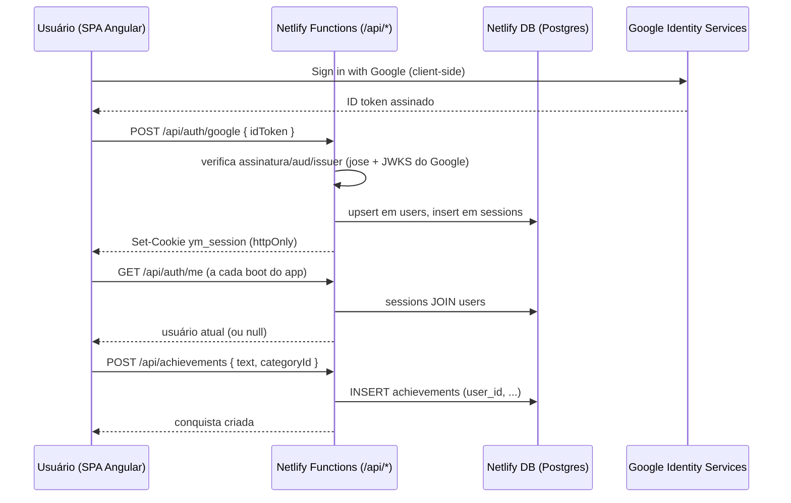

# SDD-0004: Autenticação, Persistência em Banco de Dados e Categorias Padrão

* **Autor:** Claude (Claude Code)
* **Data:** 2026-08-09
* **Status:** Implementado
* **Tags:** #auth #banco-de-dados #netlify-db #categorias

---

## 1. Visão Geral e Contexto

Até aqui o yay-me era 100% anônimo e client-side: todas as conquistas
ficavam apenas no `localStorage` do navegador, sem conceito de usuário e
sem categorias estruturadas (só tags livres geradas por IA). Isso
significava perder o histórico ao trocar de aparelho, limpar o cache ou
reinstalar o PWA — o backup/restore em JSON (SDD-0003) mitigava, mas não
resolvia.

Esta entrega adiciona autenticação (login por email/senha **ou** Google) e
persistência em um banco de dados real, provisionado via **Netlify DB**
(Postgres/Neon, gerenciado automaticamente pela Netlify), além de uma base
de categorias padrão para classificar conquistas.

## 2. Objetivos e Não-Objetivos (Goals & Non-Goals)

- **Objetivos (Goals):**
  - Cadastro e login por email/senha.
  - Login com Google (Google Identity Services).
  - Persistência de conquistas por usuário em Postgres (Netlify DB).
  - Base de 10 categorias padrão pré-cadastradas, selecionáveis ao
    registrar uma conquista.
  - Migração assistida (opt-in) dos dados que já existiam no
    `localStorage` de quem usava o app antes desta mudança.
- **Não-Objetivos (Non-Goals):**
  - Recuperação de senha por email (não há provedor de email no projeto;
    "Entrar com Google" é o caminho de recuperação quando a conta tem
    Google vinculado).
  - Categorias customizadas por usuário (o schema já tem `categories.user_id`
    pronto para isso, mas não há UI nesta entrega).
  - Verificação de email no cadastro por senha.

## 3. Arquitetura Proposta

Sessão via cookie httpOnly opaco (não JWT) validado contra uma tabela
`sessions` no Postgres — permite revogação real no logout, sem precisar
gerenciar um segredo de assinatura.

## 4. Especificação Técnica

### Banco de dados (`netlify/database/migrations/`)
- `users` (email único, `password_hash` e/ou `google_sub`, `CHECK` exige
  ao menos um método de autenticação).
- `sessions` (token com hash sha256 como chave primária, `expires_at`).
- `categories` (`user_id NULL` = categoria padrão do sistema; seed com 10
  categorias: trabalho, saúde, família, estudos, exercício, casa,
  financeiro, social, autocuidado, criatividade — mesmo vocabulário do
  prompt de IA em `celebrate-phrase.js`).
- `achievements` (`category_id` estruturado e `tags` livre de IA como
  colunas separadas; `legacy_id` único usado só na importação de dados
  antigos do `localStorage`).

### Netlify Functions (`netlify/functions/`, formato v2 ESM com `config.path`)
- `_shared/`: helpers (`db.mjs`, `session.mjs`, `password.mjs` — hash via
  `node:crypto` scrypt, sem dependência nativa —, `google.mjs` —
  verificação do ID token via `jose` —, `cookies.mjs`, `http.mjs`).
- `auth-register.mjs`, `auth-login.mjs`, `auth-google.mjs`,
  `auth-logout.mjs`, `auth-me.mjs` — rotas `/api/auth/*`.
- `categories.mjs` (`GET /api/categories`), `achievements.mjs`
  (`GET`/`POST /api/achievements`), `achievement-detail.mjs`
  (`PATCH`/`DELETE /api/achievements/:id`), `achievements-import.mjs`
  (`POST /api/achievements/import`, usado tanto por "Importar backup"
  quanto pela migração de dados locais).
- Convivem sem conflito com o `celebrate-phrase.js` existente (v1
  CommonJS, inalterado).

### Frontend Angular
- Sem Angular Router: `AppComponent` alterna entre `AuthShellComponent`
  (login/registro/Google) e o dashboard existente, via
  `AuthService.currentUser$`.
- `AuthService` (`core/services/auth.service.ts`): `bootstrap()`,
  `register()`, `login()`, `loginWithGoogle()`, `logout()`.
- `CategoryService` (`core/services/category.service.ts`): carrega
  `/api/categories`.
- `AchievementService` reescrito: deixou de usar `localStorage` como fonte
  primária, passa a chamar as Functions; mantém a mesma forma pública
  (`achievements$` como `BehaviorSubject`) para minimizar mudanças nos
  componentes consumidores.
- `AchievementFormComponent` ganhou um `p-dropdown` de categoria;
  `AchievementListComponent` exibe a categoria como chip.
- `LegacyImportPromptComponent`: ao logar, se houver dados antigos no
  `localStorage` ainda não importados, oferece importar via
  `POST /api/achievements/import` (idempotente por `legacy_id UNIQUE`).

### Configuração
- Novo `GOOGLE_CLIENT_ID` (público) propagado ao build via
  `scripts/generate-environment.js`, mesmo padrão do `GIPHY_API_KEY`.
- `netlify.toml` ganhou `[dev]` apontando `npm start` na porta 4200, para
  que `netlify dev` sirva o Angular + Functions + banco juntos.

## 5. Alternativas Consideradas

- **Extensão Auth0 da Netlify**: descartada — exige configurar um tenant
  externo (app, conexão social Google) manualmente no painel da Auth0,
  peso operacional desproporcional a um app pessoal pequeno.
- **JWT stateless em vez de sessão em banco**: descartado — como o
  Postgres já está em uso para tudo mais, uma tabela `sessions` custa
  pouco e permite revogação real no logout; JWT stateless não pode ser
  invalidado antes de expirar.
- **Angular Router com guards**: descartado por ora — o app só tem dois
  estados reais (logado/deslogado), então a alternância condicional no
  `AppComponent` é mais simples. Vale revisitar se um fluxo com deep link
  (ex.: reset de senha por email) for adicionado no futuro.

## 6. Plano de Validação e Testes

Não há harness de teste automatizado no projeto (ver `CLAUDE.md`).
Validação manual via `netlify dev` (necessário para `/api/*` e o banco
funcionarem localmente — `ng serve`/`npm start` sozinho não é suficiente):

1. `netlify dev` provisiona o banco e aplica as migrations automaticamente
   — checar que as 10 categorias padrão existem.
2. Cadastrar por email/senha → conferir cookie de sessão e que
   `/api/auth/me` retorna o usuário após refresh.
3. Logar uma conquista com categoria → conferir chip na lista.
4. Login com Google (requer `GOOGLE_CLIENT_ID` configurado e uma conta de
   teste real).
5. Logout → `/api/auth/me` volta a retornar `null`.
6. Com dados antigos no `localStorage`, logar e confirmar que o prompt de
   importação aparece uma única vez.
7. `ng build --configuration=production` sem erros (verificado nesta
   entrega).

## 7. Riscos e Questões Abertas

- [ ] Login com Google não funciona em deploy previews (a origem do
      preview não está pré-autorizada no Google Cloud Console) — só
      email/senha funciona lá; é preciso cadastrar cada origem
      manualmente se isso for necessário.
- [ ] Sem recuperação de senha por email — usuários que esquecerem a
      senha e não tiverem Google vinculado ficam sem autosserviço de
      recuperação nesta versão.
- [ ] Requer que `GOOGLE_CLIENT_ID` seja criado manualmente no Google
      Cloud Console (fora do alcance de automação) antes do login com
      Google funcionar em produção.
